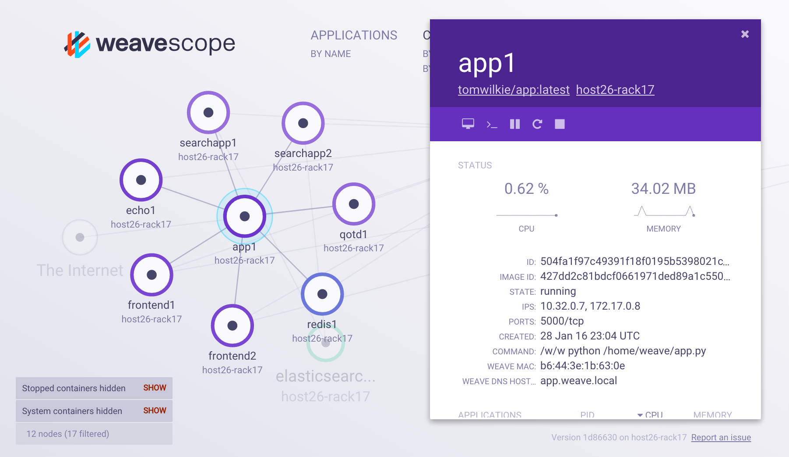
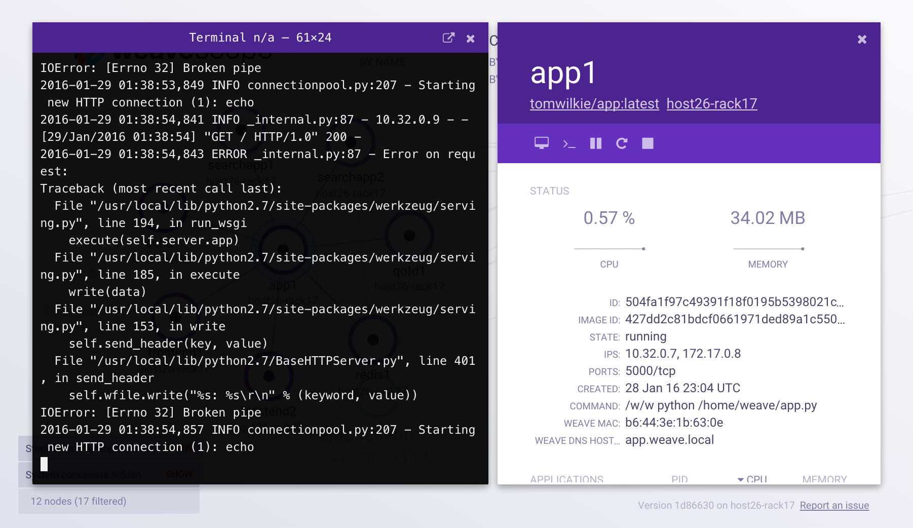

# Weave Scope - Monitoring, visualisation & management for Docker & Kubernetes

[](https://circleci.com/gh/weaveworks/scope/tree/master)
[](https://coveralls.io/r/weaveworks/scope)
[](https://goreportcard.com/report/github.com/weaveworks/scope)
[](https://slack.weave.works)
[](https://hub.docker.com/r/weaveworks/scope/)

Weave Scope automatically generates a map of your application, enabling you to
intuitively understand, monitor, and control your containerized, microservices based application.

### Understand your Docker containers in real-time


Choose an overview of your container infrastructure, or focus on a specific microservice. Easily identify and correct issues to ensure the stability and performance of your containerized applications.

### Contextual details and deep linking



View contextual metrics, tags and metadata for your containers.  Effortlessly navigate between processes inside your container to hosts your containers run on, arranged in expandable, sortable tables.  Easily to find the container using the most CPU or memory for a given host or service.

### Interact with and manage containers



Interact with your containers directly: pause, restart and stop containers. Launch a command line. All without leaving the scope browser window.

## <a name="getting-started"></a>Getting started

```
sudo curl -L git.io/scope -o /usr/local/bin/scope
sudo chmod a+x /usr/local/bin/scope
scope launch
```

This script will download and run a recent Scope image from the Docker Hub.
Now, open your web browser to **http://localhost:4040**. (If you're using
boot2docker, replace localhost with the output of `boot2docker ip`.)

For instructions on installing Scope on [Kubernetes](https://www.weave.works/docs/scope/latest/installing/#k8s), [DCOS](https://www.weave.works/docs/scope/latest/installing/#dcos) or [ECS](https://www.weave.works/docs/scope/latest/installing/#ecs), see [the docs](https://www.weave.works/docs/scope/latest/introducing/).

## <a name="help"></a>Getting help

If you have any questions about, feedback for or problem with Scope we invite
you to:
- Read [the docs](https://www.weave.works/docs/scope/latest/introducing/).
- <a href="https://slack.weave.works/">join our public slack channel</a>
- send an email to <a href="mailto:weave-users@weave.works">weave-users@weave.works</a>
- <a href="https://github.com/weaveworks/scope/issues/new">file an issue</a>

Your feedback is always welcome!

