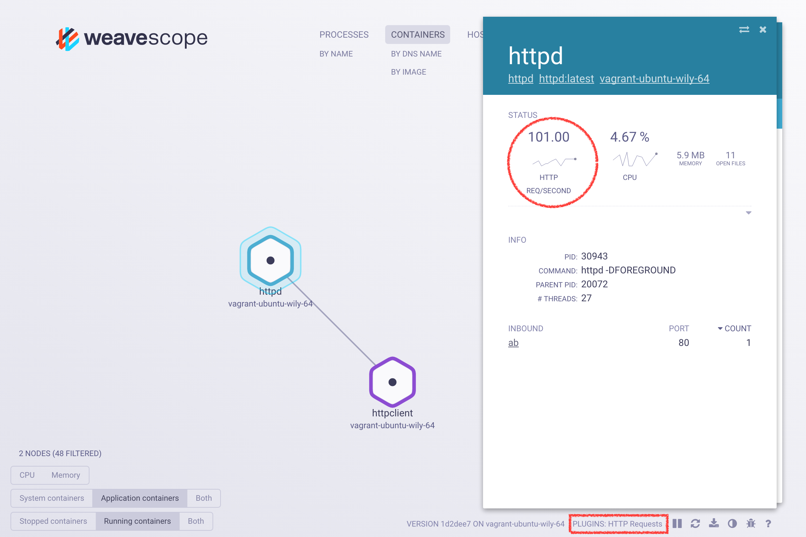

# Scope Probe Plugins

Scope probe plugins let you insert your own custom data and controls into Scope and display them in the UI.
The list of the current running plugins is displayed next to the label `PLUGINS` in the bottom right of the UI.




## Official Plugins

Official Weave Scope plugins can be found at [Weaveworks Plugins](https://github.com/weaveworks-plugins).

* [IOWait](https://github.com/weaveworks-plugins/scope-iowait): is a Go plugin that uses [iostat](https://en.wikipedia.org/wiki/Iostat) to provide host-level CPU IO wait or idle metrics.

* [HTTP Statistics](https://github.com/weaveworks-plugins/scope-http-statistics): is a Python plugin that uses [bcc](http://iovisor.github.io/bcc/) to track multiple metrics about HTTP per process. It does this without any application-level instrumentation requirements and with a negligible performance toll. This plugin is a work in progress, and implements the following (for more information read the [plugin documentation](https://github.com/weaveworks-plugins/scope-http-statistics)):
	* Number of HTTP requests per seconds.
	* Number of HTTP responses code per second (per code).

* [Traffic Control](https://github.com/weaveworks-plugins/scope-traffic-control): This plugin allows you to modify latency and packet loss for a specific container via controls from the container's detailed view in the Scope user interface.

* [Volume Count](https://github.com/weaveworks-plugins/scope-volume-count): This plugin (written in Python) requests the number of mounted volumes for each container, and provides a container-level count.

## How Plugins Communicate with Scope
This section explains the fundamental parts of the plugins structure necessary to understand how a plugin communicates with Scope.
You can find more practical examples in [Weaveworks Plugins](https://github.com/weaveworks-plugins) repositories.

### Plugin IDs

Each plugin must have a unique ID and this ID must not change
during the plugin's lifetime. Scope probes retrieve the plugin's ID
from the plugin's socket filename. For example, if a socket is named
`my-plugin.sock`, the scope probe deduces the ID as
`my-plugin`. IDs may contain only alphanumeric sequences that are optionally
separated by a dash.

### Registering Plugins

All plugins listen for HTTP connections on a UNIX socket in the `/var/run/scope/plugins` directory. The Scope probe recursively scans that directory every 5 seconds and looks for any added or removed sockets.

If you want to run permissions or store any other information with the socket, you can also put the plugin UNIX socket into a sub-directory.

When a new plugin is detected, the Scope probe begins requesting reports from it via GET /report. It is therefore important that **every plugin implements the report interface**. Implementing the report interface also means handling specific requests.

All plugin endpoints are expected to respond within 500ms, and must respond using the JSON format.

### Protocol

There are several interfaces a plugin may (or must) implement. Usually
implementing an interface means handling specific requests. These
requests are described below.

#### Reporter interface

Plugins _must_ implement the reporter interface because Scope uses it to discover which other interfaces the plugin implements.
Implementing this interface means listening for HTTP requests at `/report`.

**Note**: Plugins must add the "reporter" string to the `interfaces` field in the plugin specification even though this interface is implicitly implemented.

#### Report

When a scope probe discovers a new plugin UNIX socket it will begin
periodically making a `GET` request to the `/report` endpoint. The
report data structure returned from this is merged into the
probe's report and sent to the app. An example of the report structure
can be viewed at the `/api/report` endpoint of any scope app.

In addition to any data about the topology nodes, the report returned
from the plugin must include some metadata about the plugin itself.

For example:

```json
{
  ...,
  "Plugins": [
    {
      "id":          "plugin-id",
      "label":       "Human Friendly Name",
      "description": "Plugin's brief description",
      "interfaces":  ["reporter"],
      "api_version": "1",
    }
  ]
}
```

Note that the `Plugins` section includes exactly one plugin
description. The plugin description fields are:

* `id` - checks for duplicate plugins. It is
  required. Described in [the Plugin ID section](#plugin-id).
* `label` - a human readable plugin label displayed in the UI. It is
  required.
* `description` - displayed in the UI.
* `interfaces` - a list of interfaces which this plugin supports.  It
  is required, and must contain at least `["reporter"]`.
* `api_version` - ensure both the plugin and the scope probe
  can speak to each other. It is required, and must match the probe.

#### Controller interface

Plugins _may_ also implement the controller interface. Implementing the
controller interface means that the plugin can react to HTTP `POST`
control requests sent by the app. The plugin receives them only
for the controls it exposed in its reports. All such requests come to the
`/control` endpoint.

Add the "controller" string to the `interfaces` field in the plugin
specification.

#### Control

The `POST` requests contain a JSON-encoded body with the following contents:

```json
{
  "AppID": "some ID of an app",
  "NodeID": "an ID of the node that had the control activated",
  "Control": "the name of the activated control"
}
```

The body of the response should also be a JSON-encoded data. In most cases,
the body is an empty JSON object (so, "{}" after
serialization). If an error happens when handling the control,
then the plugin sends a response with an `error` field set, for
example:

```json
{
  "error": "An error message here"
}
```

Sometimes the control activation can make the control obsolete, and so the
plugin may want to hide it (for example, control for stopping the
container should be hidden after the container is stopped). For this
to work, the plugin sends a shortcut report by filling the
`ShortcutReport` field in the response, like so:

```json
{
  "ShortcutReport": { body of the report here }
}
```

##### How to expose controls

Each topology in the report (be it host, pod, endpoint and so on) contains
a set of available controls that a node in the topology may want to
show. The following (rather artificial) example shows a topology with
two controls (`ctrl-one` and `ctrl-two`) and two nodes, each with a different control defined:

```json
{
  "Host": {
    "controls": {
      "ctrl-one": {
        "id": "ctrl-one",
        "human": "Ctrl One",
        "icon": "far fa-futbol",
        "rank": 1
      },
      "ctrl-two": {
        "id": "ctrl-two",
        "human": "Ctrl Two",
        "icon": "fa fa-beer",
        "rank": 2
      }
    },
    "nodes": {
      "host1": {
        "latestControls": {
          "ctrl-one": {
            "timestamp": "2016-07-20T15:51:05Z01:00",
            "value": {
              "dead": false
            }
          }
        }
      },
      "host2": {
        "latestControls": {
          "ctrl-two": {
            "timestamp": "2016-07-20T15:51:05Z01:00",
            "value": {
              "dead": false
            }
          }
        }
      }
    }
  }
}
```

When control "ctrl-one" is activated, the plugin receives a
request as follows:

```json
{
  "AppID": "some ID of an app",
  "NodeID": "host1",
  "Control": "ctrl-one"
}
```

A short note about the "icon" field of the topology control - the
value for it can be taken from [Font Awesome
Cheatsheet](http://fontawesome.io/cheatsheet/)

##### Naming Nodes

Often the controller plugin may want to add some controls to already
existing nodes (for example add controls for network traffic management to nodes
representing the running Docker container). To achieve that, it is
important to make sure that the node ID in the plugin's report matches
the ID of the node created by the probe. The ID is a
semicolon-separated list of strings.

For containers, images, hosts and others, the ID is usually formatted
as `${name};<${tag}>`. The `${name}` variable is usually a name of a
thing the node represents, like an ID of the Docker container or the
hostname. The `${tag}` denotes the type of the node.

There is a fixed set of tags used by the probe:

- `host`
- `container`
- `container_image`
- `pod`
- `service`
- `deployment`
- `replica_set`

These are examples of "tagged" node names:

- The Docker container with full ID
  2299a2ca59dfd821f367e689d5869c4e568272c2305701761888e1d79d7a6f51:
  `2299a2ca59dfd821f367e689d5869c4e568272c2305701761888e1d79d7a6f51;<container>`
- The Docker image with name `docker.io/alpine`:
  `docker.io/alpine;<container_image>`
- The host with name `example.com`: `example.com:<host>`

The fixed set of tags listed above is not a complete set of names a
node can have though. For example, nodes representing processes are
have IDs formatted as `${host};${pid}`. The easiest way to
discover how the nodes are named are:

1. Read the code in
  [report/id.go](https://github.com/weaveworks/scope/blob/master/report/id.go).
2. Browse the Weave Scope GUI, select some node and search for an `id`
  key in the `nodeDetails` array in the address bar.
  - For example in the
    `http://localhost:4040/#!/state/{"controlPipe":null,"nodeDetails":[{"id":"example.com;<host>","label":"example.com","topologyId":"hosts"}],…`
    URL, you can find the `example.com;<host>` which is an ID of the node
    representing the host.
3. Mentally substitute the `<SLASH>` with `/`. This can appear in
    Docker image names, so `docker.io/alpine` in the address bar will
    be `docker.io<SLASH>alpine`.

For more detailed information visit [https://www.weave.works/documentation/scope-latest-plugins/](https://www.weave.works/documentation/scope-latest-plugins/)
