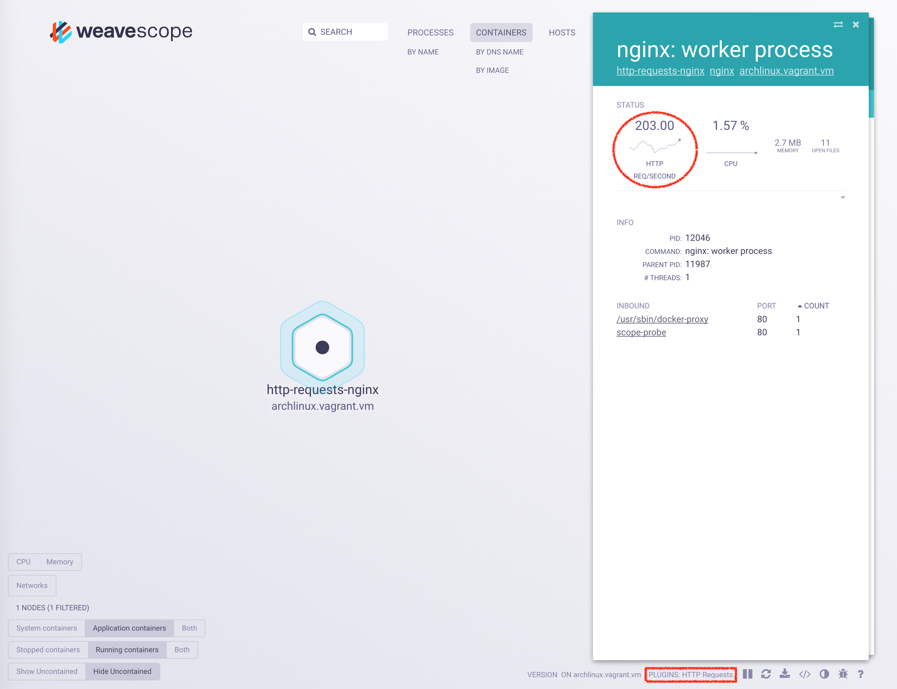

# HTTP requests plugin

The HTTP requests plugin tracks the number of incoming HTTP requests per process over time using eBPF.
The UI shows the number of requests as a single value and graph which are updated every second.
The HTTP requests plugin does not use any application-level instrumentation, it has a negligible performance toll (metrics are obtained in-kernel without any packet copying to userspace).

**Note:** This plugin needs a [recent kernel version with eBPF support](https://github.com/iovisor/bcc/blob/master/INSTALL.md#kernel-configuration).
It will not compile on current [dlite](https://github.com/nlf/dlite) and boot2docker hosts.
You need `/sys/kernel/debug/` in order to be able to build the eBPF program generated by the plugin.



If the running plugin has been registered by Scope, you will see it in the list of `PLUGINS` in the bottom right of the UI (see the rectangle in the above figure).

## Tutorial

Follow the next steps to get and run `Scope`, compile and run the HTTP requests plugin, and run a simple webserver to test the plugin.

* Get `Scope`, build it, and run it (it can take a while)

```
git clone git@github.com:weaveworks/scope.git
cd scope
make
./scope launch
```

* Run the HTTP requests plugin `cd examples/plugins/http-requests ; make`.
* In another terminal, run an `nginx` instance `docker run --name http-requests-nginx -p 8080:80 nginx`
* Run `sh test-http-requests.sh`, press Ctrl+c to terminate the test.
* Go to the Weave Scope UI [http://localhost:4040](http://localhost:4040).
* Open the `http-requests-nginx` container.
* Click on `nginx: worker process` in the "Processes" table.

## Plugin internals

Below you see the `Plugins` section of the [reporter interface](https://github.com/weaveworks/scope/tree/master/examples/plugins#reporter-interface).

```json
{
  "Plugins": [
    {
      "id":          "http-requests",
      "label":       "HTTP Requests",
      "description": "Adds http request metrics to processes",
      "interfaces":  ["reporter"],
      "api_version": "1",
    }
  ],
  ...
}
```

The HTTP requests plugin also has a `Processes` section, where the per process metrics are stored, an example of which you'll find below.

```json
{
  ...
  "Process": {
    "metric_templates": {
      "http_requests_per_second": {
        "id": "http_requests_per_second",
        "label": "HTTP Req/Second",
        "priority": 0.1
      }
    },
    "nodes": {
      "example.org;29770": {
        "metrics": {
          "http_requests_per_second": {
            "samples": [
              {
                "date": "2016-09-21T07:22:24.293175Z",
                "value": 1.0
              }
            ]
          }
        }
      }
    }
  }
}
```

`Processes` has a single `metric_template` array field containing one or more elements.
These elements describe the various types of metrics contained by each element of the `nodes` field.
Each element in the `nodes` section identifies a process on a specific host.
The element identifier is generated by concatenating the hostname and the PID with `;` as delimiter (e.g. `example.org;29770`).
Each element contains the metrics data provided by the HTTP requests plugin (just one metric in the example).
The data may contain many samples (just one in the example).
