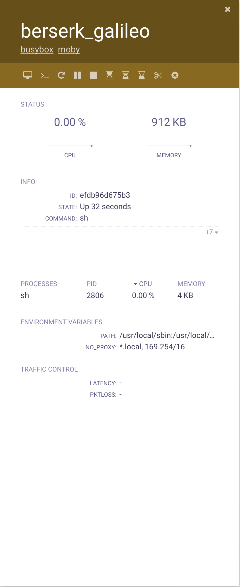
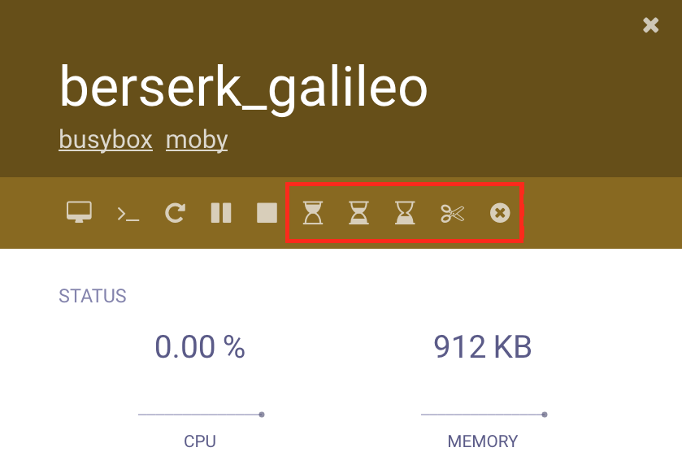

# Traffic Control Plugin

The Traffic Control plugin allows to modify the performance parameters of container's network interfaces. The following images show a simple example of how **status** and **controls** are displayed in scope UI.

## Visualization

The parameters are shown in a table named **Traffic Control**. The plugin shows the values of latency and packet loss that are enforced on the network interface. The "-" mean that no value is set for that parameter, latency is displayed in *milliseconds* (ms) and packet loss in *percentage*.

## Controls

The Traffic Controls plugin provides a simple interface to change the value of latency (hourglass buttons) and packet loss (scissor button) or remove value that was set (circled cross button). Such buttons are displayed on the top of the container detailed view, just above the STATUS section (See picture below, control are shown inside the red rectangle).

The *hourglass* buttons control the latency value, from left to right they set: 2000ms, 1000ms, and 500ms. The *scissor* button controls the packet loss value, it set a 10% packet loss. The *circled cross* button clear any previous settings.
