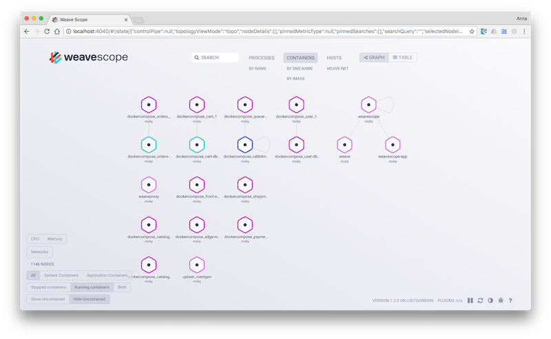
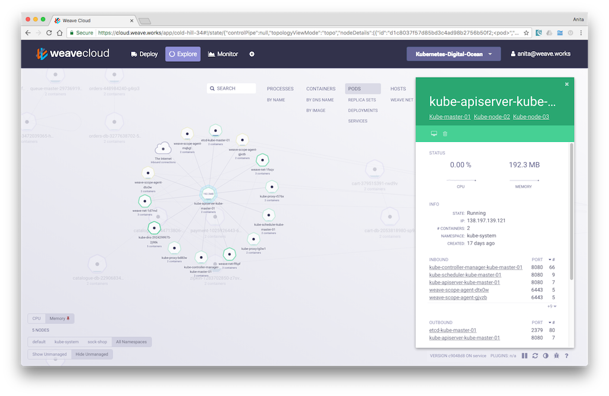
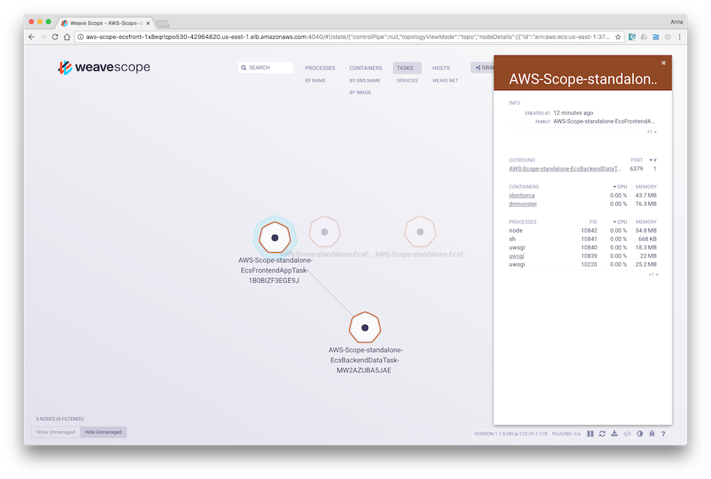
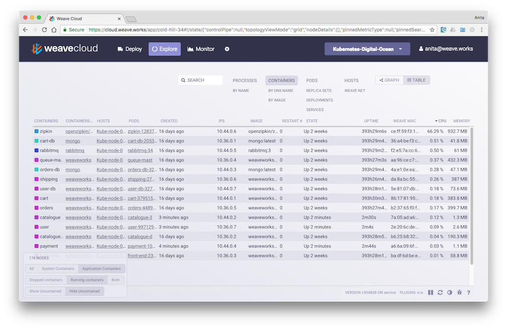
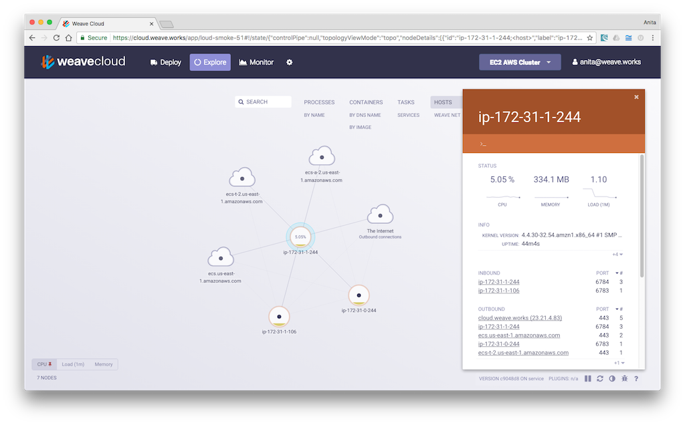
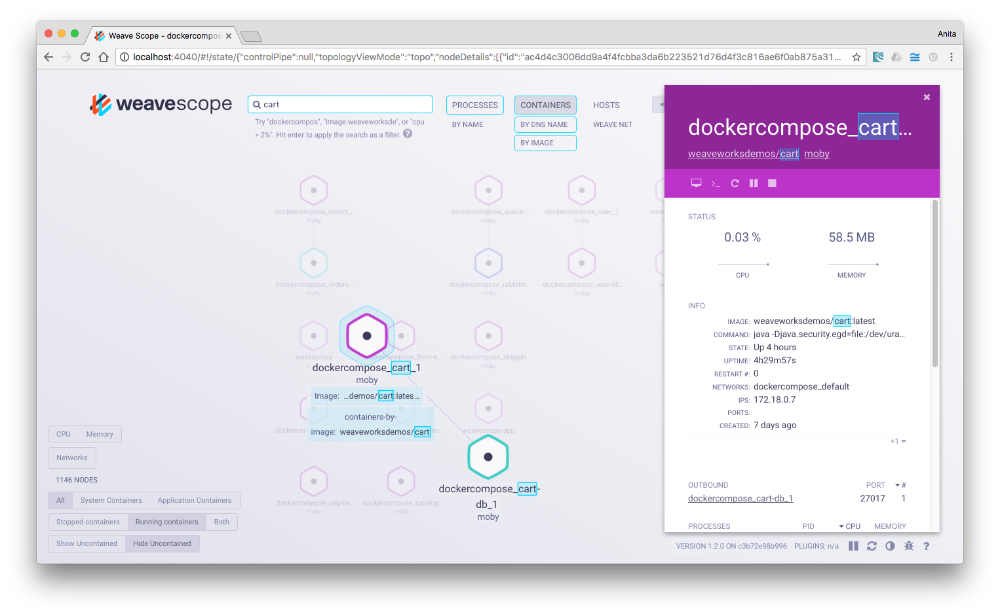
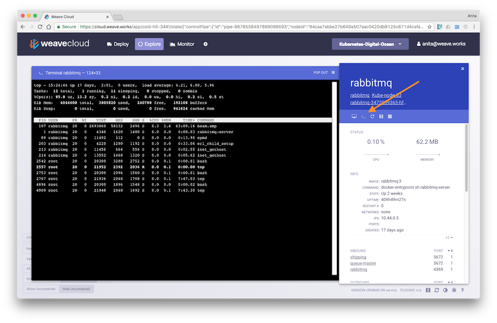

Browse the current feature set for Scope with links to relevant in-depth topics:

 * [Topology Mapping](#topology-mapping)
 * [Views in Scope](#views)
 * [Graphic or Table Mode](#mode)
 * [Flexible Filtering](#flexible-filtering)
 * [Powerful Search](#powerful-search)
 * [Real-time App and Container Metrics](#real-time-app-and-container-metrics)
 * [Troubleshoot and Manage Containers](#interact-with-and-manage-containers)
 * [Generate Custom Metrics using the Plugin API](#custom-plugins)
 

## Topology Mapping

Scope builds logical topologies of your application and infrastructure.  A topology is a collection of nodes and edges, where nodes represent objects like processes, container or hosts.  In Scope, edges indicate TCP connections between nodes.  Different node types can be filtered on and viewed and specific microservices can be drilled down on and inspected. Nodes are presented in a particular order with the clients above servers. As a general rule, you can read a Weave Scope view by going from top to bottom.

## Views in Scope

Views in Scope can be thought of as high-level filters on your containerized microservices as they run in the cloud. They are categorized into: Processes, Containers, Orchestrators, and Hosts. The Orchestrator view is context-sensitive, and as a result, if an app is running in Kubernetes, then Scope displays Pods, Replica Sets, Deployments, and Services that allow you to drill down on Kubernetes clusters.

If your app is deployed to the Amazon EC2 cluster service, then Scope displays Services and Tasks that make up an ECS cluster.

For information on how to install Scope on Kubernetes see, "[Installing Scope on Kubernetes](/site/installing.md#k8s)".

For information on how to install Scope on the AWS EC2 Container Service see, "[Installing Scope on Amazon ECS](/site/installing.md#ecs)".

Under the hosts view, and if you are running Weave Net for container networking, a specific Weave Net view appears. This view is useful for troubleshooting any networking problems you may be having. This view displays a number of Weave Net specific attributes such as whether quorum has been reached, the IP addresses used, whether fast datapath is enabled, or if encryption is running and many other useful attributes. See [Weave Net User Guide](https://www.weave.works/docs/net/latest/features/) for more information. 

## Graphic or Table Mode

In addition to these views, nodes can be presented either in graphical or in table mode. The graphical mode is practical for obtaining a quick visual overview of your app, its infrastructure and connections between all of the nodes. And when you switch to table mode, nodes are presented in a convenient list that displays the resources being consumed by processes, containers, and hosts by dynamically shifting the resource heavy nodes to the top of the table, much like the UNIX `top` command does. 

## Flexible Filtering

In the left-hand corner of the UI are other filtering and other options. Nodes can be filtered by CPU and Memory so that you can easily find containers using the most resources. In the container view, options are available to filter by system, application or to show all of the containers and if you are running an app in Kubernetes then your app can be filtered by namespace and by container state whether running or stopped or contained and uncontained. 

##  Powerful Search

Use Search to quickly find node types, containers and processes by name, label or even path.  The search functionality supports simple operands so that you can for example, find processes consuming a certain amount memory or nodes using too much CPU. Search terms may also be stacked to create custom, complex search criterion. See the online help within the product for a full list of allowable operands.

## Real-time App and Container Metrics

View contextual metrics, tags and metadata for your containers by clicking on a node to display its details panel. Drilldown on processes inside your container to the hosts that your containers run on, arranged in expandable, sortable tables.

Choose an overview of your container infrastructure, or focus on a specific microservice. Identify and correct issues to ensure the stability and performance of your containerized applications.

## Troubleshoot and Manage Containers

Click on a container, pod or host to view the controls that allow you to: pause, restart, stop and delete without having to leave the Scope browser window. Logs of selected containers or pods (if you are running Kubernetes) can also be displayed by clicking the terminal icon.

And if further troubleshooting is required, terminal windows can be launched from any container or host so that you can interact with your app and run any UNIX command to diagnose issues.  Launch a terminal by clicking the `>_` icon from the details panel of a selected container or host. 

## Generate Custom Metrics using the Plugin API

Scope includes a Plugin API, so that custom metrics may be generated and integrated with the Scope UI.

For information on how to generate your own metrics in Scope, see [Generating Custom Metrics with Plugins](/site/plugins.md).
