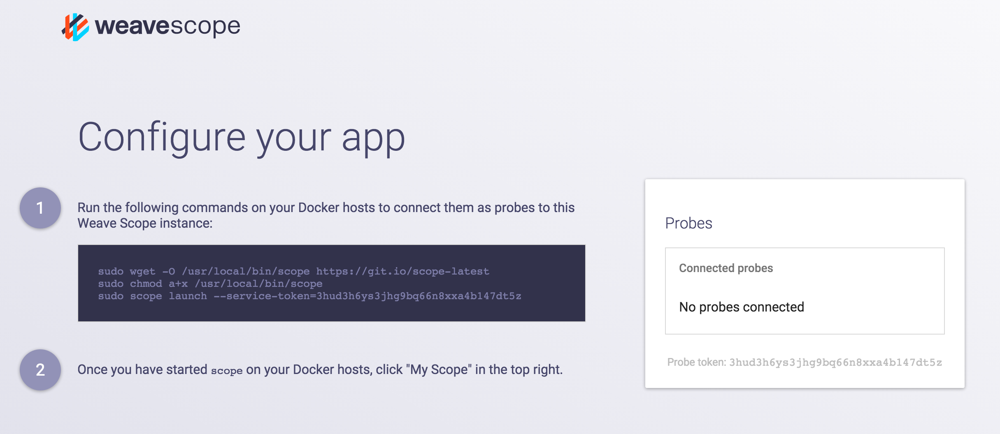

The following topics are discussed:

* [Service Mode](#scope-reporting-in-service-mode)
* [Stand-alone Mode](#scope-reporting-in-stand-alone-mode)
* [Managing Clusters with Scope and weaveDNS](#managing-clusters-with-scope-and-weavedns)

Weave Scope consists of two components: the app and the probe. The components are deployed as a single Docker container using the scope script. The probe is responsible for gathering information about the host on which it is running. This information is sent to the app in the form of a report. The app processes reports from the probe into usable topologies, serving the UI, as well as pushing these topologies to the UI.

    +--Docker host----------+
    |  +--Container------+  |    .---------------.
    |  |                 |  |    | Browser       |
    |  |  +-----------+  |  |    |---------------|
    |  |  | scope-app |<---------|               |
    |  |  +-----------+  |  |    |               |
    |  |        ^        |  |    |               |
    |  |        |        |  |    '---------------'
    |  | +-------------+ |  |
    |  | | scope-probe | |  |
    |  | +-------------+ |  |
    |  |                 |  |
    |  +-----------------+  |
    +-----------------------+

##Standalone Mode

When running Scope in a cluster, each probe sends its reports to a dedicated app. The app merges the reports from its probe into a comprehensive report that is sent to the browser.  To visualize your entire infrastructure and apps running on that infrastructure, Scope must be launched on to every machine you are using.

    +--Docker host----------+      +--Docker host----------+
    |  +--Container------+  |      |  +--Container------+  |
    |  |                 |  |      |  |                 |  |
    |  |  +-----------+  |  |      |  |  +-----------+  |  |
    |  |  | scope-app |<-----.    .----->| scope-app |  |  |
    |  |  +-----------+  |  | \  / |  |  +-----------+  |  |
    |  |        ^        |  |  \/  |  |        ^        |  |
    |  |        |        |  |  /\  |  |        |        |  |
    |  | +-------------+ |  | /  \ |  | +-------------+ |  |
    |  | | scope-probe |-----'    '-----| scope-probe | |  |
    |  | +-------------+ |  |      |  | +-------------+ |  |
    |  |                 |  |      |  |                 |  |
    |  +-----------------+  |      |  +-----------------+  |
    +-----------------------+      +-----------------------+

## Service Mode

Scope can also be used to feed reports to the Scope Service. The Scope Service allows you centrally manage and share access to your Scope UI. In this configuration, the probe is run locally and the apps are hosted for you.

                           .-~~~-.
                     .- ~'`       )_   ___
                    /               `-'   )_
                   |    scope.weave.works   \
                    \                      .'
                      ~-______________..--'
                               ^^
                               ||
                               ||
    +--Docker host----------+  ||  +--Docker host----------+
    |  +--Container------+  |  ||  |  +--Container------+  |
    |  |                 |  |  ||  |  |                 |  |
    |  | +-------------+ |  | /  \ |  | +-------------+ |  |
    |  | | scope-probe |-----'    '-----| scope-probe | |  |
    |  | +-------------+ |  |      |  | +-------------+ |  |
    |  |                 |  |      |  |                 |  |
    |  +-----------------+  |      |  +-----------------+  |
    +-----------------------+      +-----------------------+

To register with the service, go to [scope.weave.works](https://scope.weave.works), enter your email address and wait for the confirmation email that contains your service token.

>**Note**: Candidates for the Early Access Program are evaluated on a case per case basis. It may take a few days before you receive a confirmation email. To accelerate the process, please send an email to `help@weave.works` which explains your use-case.

The service token is also accessible from the Scope as a Service main page after you've logged in:

##Disabling Automatic Updates

Scope periodically checks with our servers to see if a new version is available. You can disable this by setting:

    CHECKPOINT_DISABLE=true scope launch

For more information, see [Go Checkpoint](https://github.com/weaveworks/go-checkpoint).

**See Also**

 * [Installing Weave Scope](/site/installing-scope.md)

