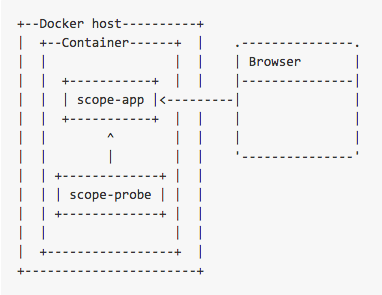
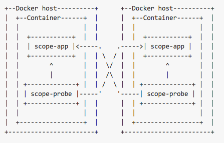

The following topics are discussed: 

* [Service Mode](#scope-reporting-in-service-mode)
* [Stand-alone Mode](#scope-reporting-in-stand-alone-mode)
* [Managing Clusters with Scope and weaveDNS](#managing-clusters-with-scope-and-weavedns)

Weave Scope consists of two components: the app and the probe. The components are deployed as a single Docker container using the scope script. The probe is responsible for gathering information about the host on which it is running. This information is sent to the app in the form of a report. The app processes reports from the probe into usable topologies, serving the UI, as well as pushing these topologies to the UI.

## Service Mode

Scope can also be used to feed reports to the Scope Service. The Scope Service allows you centrally manage and share access to your Scope UI. In this configuration, the probe is run locally and the apps are hosted for you.

##Standalone Mode

When running Scope in a cluster, each probe sends its reports to a dedicated app. The app merges the reports from its probe into a comprehensive report that is sent to the browser.  To visualize your entire infrastructure and apps running on that infrastructure, Scope must be launched on to every machine you are using.

##Managing Clusters with Scope and weaveDNS

If Scope is running on the same machine as the Weave Network, then the probe uses weaveDNS to automatically discover any other apps on the network. Scope does this by registering itself under the address scope.weave.local. 

Each probe sends its reports to every app registered at this address. If you have weaveDNS set up and running, no further steps are necessary. 

If you don’t want to use weaveDNS, then Scope can be instructed to cluster with other Scope instances on the command line. Hostnames and IP addresses are acceptable, both with and without ports, for example:

    # scope launch scope1:4030 192.168.0.12 192.168.0.11:4030

Hostnames will be regularly resolved as A records, and each answer used as a target.

**See Also**

 * [Installing Weave Scope](/site/installing-scope.md)
 
