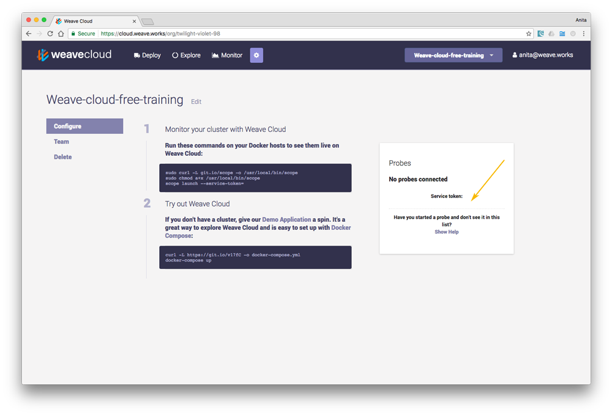

The following topics are discussed:

* [Weave Cloud](#service-mode)
* [Standalone Mode](#stand-alone-mode)
* [Disabling Automatic Updates](#disable)

Weave Scope consists of two components: the app and the probe. The components are deployed as a single Docker container using the scope script. The probe is responsible for gathering information about the host on which it is running. This information is sent to the app in the form of a report. The app processes reports from the probe into usable topologies, serving the UI, as well as pushing these topologies to the UI.

    +--Docker host----------+
    |  +--Container------+  |    .---------------.
    |  |                 |  |    | Browser       |
    |  |  +-----------+  |  |    |---------------|
    |  |  | scope-app |<---------|               |
    |  |  +-----------+  |  |    |               |
    |  |        ^        |  |    |               |
    |  |        |        |  |    '---------------'
    |  | +-------------+ |  |
    |  | | scope-probe | |  |
    |  | +-------------+ |  |
    |  |                 |  |
    |  +-----------------+  |
    +-----------------------+

## Standalone Mode

When running Scope in a cluster, each probe sends its reports to a dedicated app. The app merges the reports from its probe into a comprehensive report that is sent to the browser.  To visualize your entire infrastructure and apps running on that infrastructure, Scope must be launched on to every machine you are using.

    +--Docker host----------+      +--Docker host----------+
    |  +--Container------+  |      |  +--Container------+  |
    |  |                 |  |      |  |                 |  |
    |  |  +-----------+  |  |      |  |  +-----------+  |  |
    |  |  | scope-app |<-----.    .----->| scope-app |  |  |
    |  |  +-----------+  |  | \  / |  |  +-----------+  |  |
    |  |        ^        |  |  \/  |  |        ^        |  |
    |  |        |        |  |  /\  |  |        |        |  |
    |  | +-------------+ |  | /  \ |  | +-------------+ |  |
    |  | | scope-probe |-----'    '-----| scope-probe | |  |
    |  | +-------------+ |  |      |  | +-------------+ |  |
    |  |                 |  |      |  |                 |  |
    |  +-----------------+  |      |  +-----------------+  |
    +-----------------------+      +-----------------------+

## Weave Cloud

Scope can also be used to feed reports to Weave Cloud. With Weave Cloud, you can centrally manage and share access to your Scope UI. In this configuration, the probe is run locally and the apps are hosted for you.

                           .-~~~-.
                     .- ~'`       )_   ___
                    /               `-'   )_
                   |    cloud.weave.works   \
                    \                      .'
                      ~-______________..--'
                               ^^
                               ||
                               ||
    +--Docker host----------+  ||  +--Docker host----------+
    |  +--Container------+  |  ||  |  +--Container------+  |
    |  |                 |  |  ||  |  |                 |  |
    |  | +-------------+ |  | /  \ |  | +-------------+ |  |
    |  | | scope-probe |-----'    '-----| scope-probe | |  |
    |  | +-------------+ |  |      |  | +-------------+ |  |
    |  |                 |  |      |  |                 |  |
    |  +-----------------+  |      |  +-----------------+  |
    +-----------------------+      +-----------------------+

To register with Weave Cloud, go to [https://cloud.weave.works](https://cloud.weave.works), enter your email address and wait for the confirmation email.

The cloud token is accessible from the settings page after you've clicked 'Explore':

## Disabling Automatic Updates

Scope periodically checks with our servers to see if a new version is available. You can disable this by setting:

    CHECKPOINT_DISABLE=true scope launch

For more information, see [Go Checkpoint](https://github.com/weaveworks/go-checkpoint).

**See Also**

 * [Installing Weave Scope](/site/installing.md)

