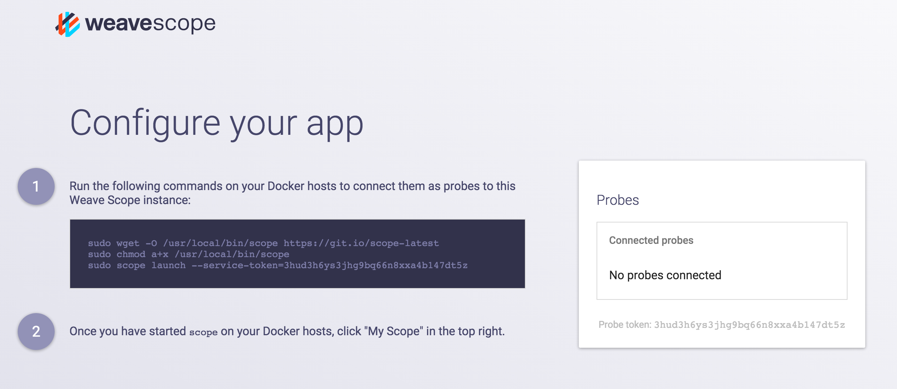

Weave Scope consists of three parts: the probe, the app and the user interface. It can be deployed either as a standalone configuration, or if you don’t want to manage the administration yourself, you can sign up for Weave Scope as a service.

The following topics are discussed: 

 * [Weave Scope Cloud Service](#signing-up-for-weave-scope-cloud-service)
 * [Installing Weave Scope Standalone](#installing-weave-scope-standalone)

##Signing Up for Weave Scope as a Service

With Scope as a Service you can centrally manage and share access to your Scope user interface. In this configuration, the probe is run locally on your hosts, and the scope apps are hosted for you.

To register with the service, go to [scope.weave.works](https://scope.weave.works), enter your email address and wait for the confirmation email that contains your service token.

>**Note**: Candidates for the Early Access Program are evaluated on a case per case basis. It may take a few days before you receive a confirmation email. To accelerate the process, please send an email to `help@weave.works` which explains your use-case.

The service token is also accessible from the Scope as a Service main page after you've logged in:

###Launching Scope as a Service

Run a probe on every machine that you want to monitor using the following:

    sudo scope launch --service-token=<token>

Where, 

`--service-token=<token>`  is the token that was sent to you when you signed 
up.

Once the probes have been launched, log into the Scope service, and click on 'My Scope' in the top right-hand corner. 

##Installing Weave Scope Standalone

To install Scope in the standalone configuration, run the following:

    sudo wget -O /usr/local/bin/scope https://git.io/scope
    sudo chmod a+x /usr/local/bin/scope
    sudo scope launch

Scope needs to be installed onto every machine that you want to monitor. Once launched, Scope doesn’t require any other configuration and it also doesn’t depend on Weave Net.

The script downloads and runs the latest released Scope image from the Docker Hub. After it’s been launched, open your browser to `http://localhost:4040`.

>**Note:** If you're using boot2docker, replace localhost with the output of boot2docker IP.

>  Scope allows anyone with access to the UI control over your containers: as such, the Scope app endpoint (port 4040) should not be made accessible on the Internet.  Additionally traffic between the app and the probe is currently insecure and should also not traverse the Internet.

###Disabling Automatic Updates

Scope periodically checks with our servers to see if a new version is available. You can disable this by setting:

    CHECKPOINT_DISABLE=true scope launch

For more information, see [Go Checkpoint](https://github.com/weaveworks/go-checkpoint).

**See Also**

 * [Understanding Weave Scope](/site/how-it-works.md)
 * [Managing Clusters with Scope and weaveDNS](/site/how-it-works.md#managing-clusters-with-scope-and-weavedns)
 * [Integrations](/site/integrations.md)
 