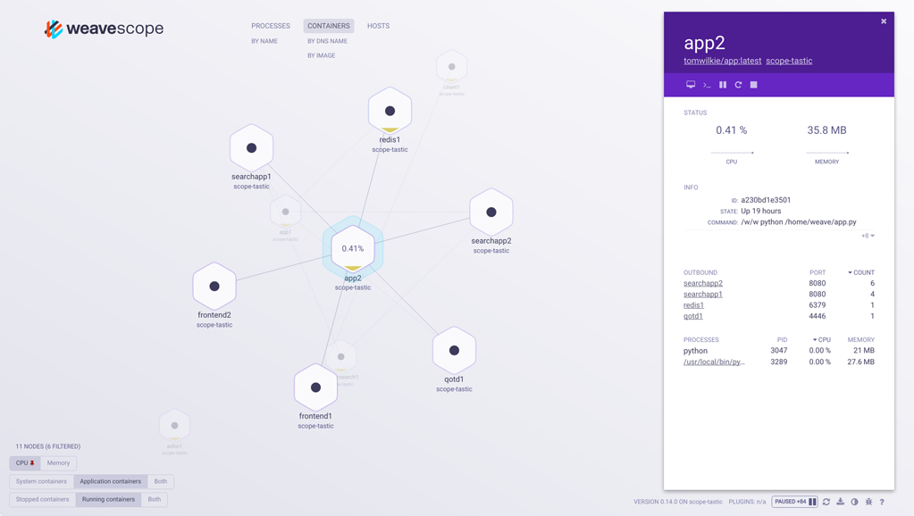
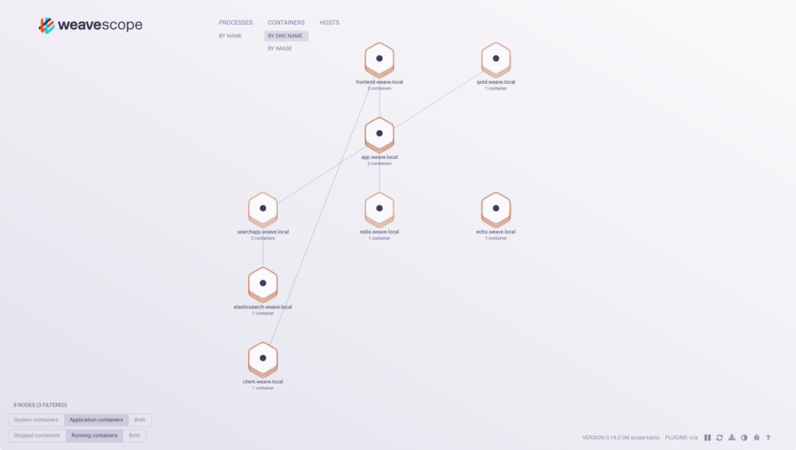

Weave Scope is a visualization, and monitoring tool for Docker and Kubernetes. It provides a top down view into your app as well as your entire infrastructure, and allows you to diagnose any problems with your distributed containerized app, in real time, as it being deployed to a cloud provider.

To install Scope on your local Docker machine, run the following commands:

    sudo curl -L git.io/scope -o /usr/local/bin/scope
    sudo chmod a+x /usr/local/bin/scope
    scope launch

Scope can be used in standalone mode, where you deploy it locally onto your hosts, or you can use Weave Scope in [Weave Cloud](https://cloud.weave.works).  Scope can be deployed to Kubernetes, DCOS and ECS clusters.  See [Installing Weave Scope](/site/installing.md) for more information.

## Getting Microservices Under Control

Microservices-based architecture poses significant challenges when deployed to Docker containers in the cloud. Microservices tend to be dynamic with many distributed components, which can make monitoring difficult. But with Weave Scope, visualizing network bottlenecks, troubleshooting CPU consumption and memory leaks is simplified. With Views, you can quickly examine various metrics about your containerized app.

## Automatic Topologies and Intelligent Grouping

Weave Scope generates a map of your processes, containers and hosts, so that you can understand, monitor, and control your applications.

It uses established APIs (for example: /proc, conntrack, the Docker API etc.) to gather information about the hosts on which it is running. And it does this without any modifications to your application or needing a custom kernel module.

Information collected by Weave Scope’s probes is used to build a topology of the applications and the containers running on the hosts.  Reports are generated locally by the probe (agent) and then sent to the app via HTTP, where they are merged and processed to form cluster-wide views.

Intelligently group nodes to help diagnose problems in your app as well as to clarify and model its infrastructure set up.  For example, you can use the Docker ‘containers-grouped-by-hostname’ view to identify and dedupe replicas of containers that back multiple services, and show which services within your Docker infrastructure are in communication.

## Developer Friendly: Contextual Details and Metrics

Drill down on nodes in any topology, and view contextual details for your containers, hosts and processes.  Metrics have been brought front and center, the tags and metadata user interface redefined with the children of your container/host arranged in expandable, sortable tables.  For example, the container consuming the most CPU or memory on a given host can be determined quickly with just a few clicks.

Weave Scope accumulates and stores 15-second sparklines of metrics such as memory and CPU usage, These provide a snapshot so that you can quickly understand how your containers are performing.

You can drill up and down between the various topologies that Scope natively understands. This enables you to easily navigate from containers, to hosts, processes, images, pods and services - and back again.

Scope can display metrics from Weave Net, Docker Containers, and the Linux Kernel.

## Real-time Container Monitoring

With Weave Scope you can control the entire container lifecycle across your cluster hosts from a single UI.  Start, stop, pause and restart containers from the details panel, and toggle filters for stopped containers in the containers view.

Controlling Scope containers goes beyond simple lifecycle operations. Scope can also attach and exec. Attach executes a Docker attach against the container and lets you interact with it live.  Exec runs a shell in the container so that you can debug your running app in real-time.

## Orchestrator Aware and Cloud Integrations

Weave Scope can visualize your app within:

 * Docker Datacenter
 * Kubernetes
 * Amazon ECS

**See Also**

 * [Installing Weave Scope](/site/installing.md)
 * [Feature Overview](/site/features.md)

