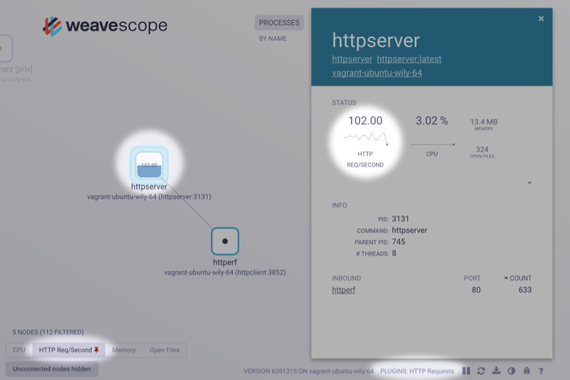

The following topics are discussed:

 * [Official Plugins](#official-plugins)
 * [How Plugins Communicate with Scope](#plugins-internals)
  * [Plugin IDs](#plugin-id)
  * [Registering Plugins](#plugin-registration)
  * [Reporter Interface](#reporter-interface)
  * [Controller Interface](#controller-interface)
     * [Control](#control)
     * [How to Expose Controls](#expose-controls)
     * [Naming Nodes](#naming-nodes)
 * [A Guide to Developing Plugins](#plugins-developing-guide)
  * [Setting up the Structure](#structure)
  * [Defining the Reporter Interface](#reporter-interface)

Any kind of metrics can be generated and inserted into Scope using custom plugins. Metrics generated through your plugin are displayed in the user interface alongside the standard set of metrics that are found in Weave Scope.



## <a id="official-plugins"></a>Official Plugins

Official Weave Scope plugins can be found at [Weaveworks Plugins](https://github.com/weaveworks-plugins).

* [IOWait](https://github.com/weaveworks-plugins/scope-iowait): is a Go plugin that uses [iostat](https://en.wikipedia.org/wiki/Iostat) to provide host-level CPU IO wait or idle metrics.

* [HTTP Statistics](https://github.com/weaveworks-plugins/scope-http-statistics): is a Python plugin that uses [bcc](http://iovisor.github.io/bcc/) to track multiple metrics about HTTP per process. It does this without any application-level instrumentation requirements and without a negligible performance toll. This plugin is a work in progress, and currently implements the following (for more information read the [plugin documentation](https://github.com/weaveworks-plugins/scope-http-statistics)):
	* Number of HTTP requests per seconds.
	* Number of HTTP responses code per second (per code).

> **Note:** The HTTP Statistics plugin requires a [recent kernel version with ebpf support](https://github.com/iovisor/bcc/blob/master/INSTALL.md#kernel-configuration) and it will not compile on [dlite](https://github.com/nlf/dlite) or on boot2docker hosts.

* [Traffic Control](https://github.com/weaveworks-plugins/scope-traffic-control): This plugin allows you to modify latency and packet loss for a specific container via controls from the container's detailed view in the Scope user interface.

* [Volume Count](https://github.com/weaveworks-plugins/scope-volume-count): This plugin (written in Python) requests the number of mounted volumes for each container, and provides a container-level count.

>**Note:**Installed and running plugins are shown in the list of `PLUGINS` in the bottom right of the Scope UI.

## <a id="plugins-internals"></a>How Plugins Communicate with Scope

In this section how the different components of a plugin communicate with Scope are described. You can also find practical examples of how plugins work in the [Weaveworks Plugins](https://github.com/weaveworks-plugins) repositories.

### <a id="plugin-id"></a>Plugin IDs

Each plugin must have a unique ID and this ID must not change
during the plugin's lifetime. Scope probes retrieve the plugin's ID
from the plugin's socket filename. For example, if a socket is named
`my-plugin.sock`, the scope probe deduces the ID as
`my-plugin`. IDs may contain only alphanumeric sequences that are optionally
separated by a dash.

### <a id="plugin-registration"></a>Registering Plugins

All plugins listen for HTTP connections on a UNIX socket in the `/var/run/scope/plugins` directory. The Scope probe recursively scans that directory every 5 seconds and looks for any added or removed sockets.

If you want to run permissions or store any other information with the socket, you can also put the plugin UNIX socket into a sub-directory.

When a new plugin is detected, the Scope probe begins requesting reports from it via `GET /report`. It is therefore important that **every plugin implements the report interface**. Implementing the report interface also means handling specific requests.

All plugin endpoints are expected to respond within 500ms, and **must** respond using the JSON format.

### <a id="reporter-interface"></a>Reporter Interface

When a Scope probe discovers a new plugin UNIX socket, it begins to periodically make a `GET` request to the `/report` endpoint. The report data structure returned from this is merged into the probe's report and sent to the app. An example of the report structure can be viewed at the `/api/report` endpoint of any Scope app.

In addition to any data about the topology nodes, the report returned from the plugin must include some metadata about the plugin itself.

For example:

```json
{
  ...,
  "Plugins": [
    {
      "id":          "plugin-id",
      "label":       "Human Friendly Name",
      "description": "Plugin's brief description",
      "interfaces":  ["reporter"],
      "api_version": "1",
    }
  ]
}
```

> **Note:** The `Plugins` section includes exactly one plugin description that displays in the UI. The other plugin fields are:

* `id` - checks for duplicate plugins. It is required.
* `label` - a human readable label displayed in the UI. It is required.
* `description` - displayed in the UI. It is required.
* `interfaces` - a list of interfaces that the plugin supports. It is required, and must contain at least `["reporter"]`.
* `api_version` - ensure both the plugin and the scope probe can speak to each other. It is required, and must match the probe's value.

### <a id="controller-interface"></a>Controller Interface

Plugins _may_ also implement the controller interface. Implementing the
controller interface means that the plugin can react to HTTP `POST`
control requests sent by the app. The plugin receives them only
for the controls it exposed in its reports. All such requests come to the
`/control` endpoint.

Add the "controller" string to the interfaces field in the plugin specification.

#### <a id="control"></a> Control

The `POST` requests contain a JSON-encoded body with the following:

```json
{
  "AppID": "some ID of an app",
  "NodeID": "an ID of the node that had the control activated",
  "Control": "the name of the activated control"
}
```

The body of the response should also be JSON-encoded data. In most cases,
the body is an empty JSON object (so, "{}" after
serialization). If an error occurs when handling the control,
then the plugin sends a response with an `error` field set, for
example:

```json
{
  "error": "An error message here"
}
```

Sometimes the control activation can make the control obsolete, and so the
plugin may want to hide it (for example, control for stopping the
container should be hidden after the container is stopped). For this
to work, the plugin sends a shortcut report by filling the
`ShortcutReport` field in the response, like so:

```json
{
  "ShortcutReport": { body of the report here }
}
```

#### <a id="expose-controls"></a>How to Expose Controls

Each topology in the report (be it host, pod, endpoint and so on) contains
a set of available controls that a node in the topology may want to
show. The following (rather artificial) example shows a topology with
two controls (`ctrl-one` and `ctrl-two`) and two nodes, each with a different control defined:

```json
{
  "Host": {
    "controls": {
      "ctrl-one": {
        "id": "ctrl-one",
        "human": "Ctrl One",
        "icon": "fa-futbol-o",
        "rank": 1
      },
      "ctrl-two": {
        "id": "ctrl-two",
        "human": "Ctrl Two",
        "icon": "fa-beer",
        "rank": 2
      }
    },
    "nodes": {
      "host1": {
        "latestControls": {
          "ctrl-one": {
            "timestamp": "2016-07-20T15:51:05Z01:00",
            "value": {
              "dead": false
            }
          }
        }
      },
      "host2": {
        "latestControls": {
          "ctrl-two": {
            "timestamp": "2016-07-20T15:51:05Z01:00",
            "value": {
              "dead": false
            }
          }
        }
      }
    }
  }
}
```

When control "ctrl-one" is activated, the plugin receives a
request as follows:

```json
{
  "AppID": "some ID of an app",
  "NodeID": "host1",
  "Control": "ctrl-one"
}
```

A short note about the "icon" field of the topology control - the
value for it can be taken from [Font Awesome
Cheatsheet](http://fontawesome.io/cheatsheet/)

#### <a id="naming-nodes"></a>Naming Nodes

Often the controller plugin may want to add controls to already
existing nodes (for example add controls for network traffic management to nodes
representing the running Docker container). To achieve that, it is
important to make sure that the node ID in the plugin's report matches
the ID of the node created by the probe. The ID is a
semicolon-separated list of strings.

For containers, images, hosts and others, the ID is usually formatted
as `${name};<${tag}>`. The `${name}` variable is usually a name of a
thing the node represents, like an ID of the Docker container or the
hostname. The `${tag}` denotes the type of the node.

There is a fixed set of tags used by the probe:

- `host`
- `container`
- `container_image`
- `pod`
- `service`
- `deployment`
- `replica_set`

These are examples of "tagged" node names:

- The Docker container with full ID
  2299a2ca59dfd821f367e689d5869c4e568272c2305701761888e1d79d7a6f51:
  `2299a2ca59dfd821f367e689d5869c4e568272c2305701761888e1d79d7a6f51;<container>`
- The Docker image with name `docker.io/alpine`:
  `docker.io/alpine;<container_image>`
- The host with name `example.com`: `example.com;<host>`

The fixed set of tags listed above is not a complete set of names a
node can have though. For example, nodes representing processes
have IDs formatted as `${host};${pid}`. The easiest way to
discover how the nodes are named are:

 1.  Read the code in
  [report/id.go](https://github.com/weaveworks/scope/blob/master/report/id.go).
 2.  Browse the Weave Scope GUI, select some node and search for an `id`
  key in the `nodeDetails` array in the address bar.
  - For example in the
    `http://localhost:4040/#!/state/{"controlPipe":null,"nodeDetails":[{"id":"example.com;<host>","label":"example.com","topologyId":"hosts"}],…`
    URL, you can find the `example.com;<host>` which is an ID of the node
    representing the host.
 3. Mentally substitute the `<SLASH>` with `/`. This can appear in
    Docker image names, so `docker.io/alpine` in the address bar will
    be `docker.io<SLASH>alpine`.


## <a id="plugins-developing-guide"></a>A Guide to Developing Plugins

This section explains how to develop a simple plugin in Go. The code used here is a simplified version of the [Scope IOWait](https://github.com/weaveworks-plugins/scope-iowait) plugin.

### <a id="structure"></a>Setting up the Structure

As stated in the previous section, plugins need to be put into the `/var/run/scope/plugins` socket directory to be able to communicate with Scope. The best practice is to put the socket into a sub-directory and name it with the plugin ID (for example, `/var/run/scope/plugins/plugins-id/plugins-id.sock`). This is useful because the plugin can set more restrictive permissions to avoid unauthorized access as well as store other information along with the socket if needed.

Example of a helper function for setting up the socket:

```go
func setupSocket(socketPath string) (net.Listener, error) {
	os.RemoveAll(filepath.Dir(socketPath))
	if err := os.MkdirAll(filepath.Dir(socketPath), 0700); err != nil {
		return nil, fmt.Errorf("failed to create directory %q: %v", filepath.Dir(socketPath), err)
	}
	listener, err := net.Listen("unix", socketPath)
	if err != nil {
		return nil, fmt.Errorf("failed to listen on %q: %v", socketPath, err)
	}

	log.Printf("Listening on: unix://%s", socketPath)
	return listener, nil
}
```

Because Scope detects running plugins by looking into the `/var/run/scope/plugins` directory, plugins should remove their socket and the directory (if created) when they exit. The side effect of not doing that is that the Scope UI will show that a plugin is running but that it is not reachable.

To remove the socket, and the directory, you can use the following helper function:

```go
func setupSignals(socketPath string) {
	interrupt := make(chan os.Signal, 1)
	signal.Notify(interrupt, os.Interrupt, syscall.SIGTERM)
	go func() {
		<-interrupt
		os.RemoveAll(filepath.Dir(socketPath))
		os.Exit(0)
	}()
}
```

Also add the following to the main function the following:

```golang
defer func() {
		os.RemoveAll(filepath.Dir(socketPath))
	}()
```

This ensures that when the plugin terminates because of an error or an interrupt command, the `/var/run/scope/plugins/plugins-id` directory will be removed.

A bare minimum boilerplate can be the following:

```go
package main

import (
	syscall
)

func main() {
	const socketPath = "/var/run/scope/plugins/my-plugin/my-plugin.sock"
	setupSignals(socketPath)

	listener, err := setupSocket(socketPath)

	plugin := &Plugin{}
	http.HandleFunc("/report", plugin.Report)

	defer func() {
		listener.Close()
		os.RemoveAll(filepath.Dir(socketPath))
	}()
}

```

### <a id="reporter-interface"></a>Defining the Reporter Interface

As stated in the [How Plugins Communicate with Scope](#plugins-internals) section, the reporter interface is mandatory.
Implementing the reporter interface means handling `GET /report` requests.

The following code snippet is sufficient to implement it:

```go
// Plugin groups the methods a plugin needs
type Plugin struct {
	lock       sync.Mutex
}

type report struct {
	Plugins []pluginSpec
}

func (p *Plugin) makeReport() (*report, error) {
	rpt := &report{
		Plugins: []pluginSpec{
			{
				ID:          "plugin-id",
				Label:       "Plugin Name",
				Description: "Plugin short description",
				Interfaces:  []string{"reporter"},
				APIVersion:  "1",
			},
		},
	}
	return rpt, nil
}

// Report is called by scope when a new report is needed. It is part of the
// "reporter" interface, which all plugins must implement.
func (p *Plugin) Report(w http.ResponseWriter, r *http.Request) {
	p.lock.Lock()
	defer p.lock.Unlock()
	log.Println(r.URL.String())
	rpt, err := p.makeReport()
	if err != nil {
		log.Printf("error: %v", err)
		http.Error(w, err.Error(), http.StatusInternalServerError)
		return
	}
	raw, err := json.Marshal(*rpt)
	if err != nil {
		log.Printf("error: %v", err)
		http.Error(w, err.Error(), http.StatusInternalServerError)
		return
	}
	w.WriteHeader(http.StatusOK)
	w.Write(raw)
}

```

**See Also**

  * [Building Scope](/site/building.md)


