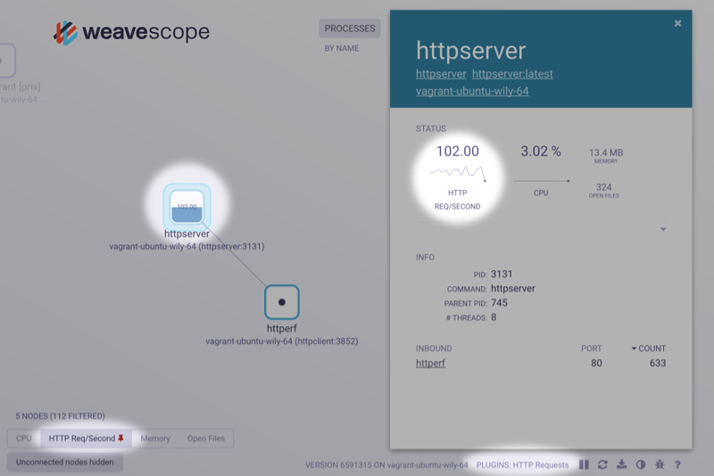

The following topics are discussed: 

 * [Listening Protocol](#listening-protocol)
 * [Reporting](#reporting)
 * [Interfaces](#interfaces)

With a Scope probe plugin, you can insert custom metrics into Scope and have them display in the user interface together with the Scope's standard set of metrics.




You can find some examples in [the example plugins](https://github.com/weaveworks/scope/tree/master/examples/plugins) directory.

There are currently two different examples:

* A [Python plugin](https://github.com/weaveworks/scope/tree/master/examples/plugins/http-requests) using [bcc](http://iovisor.github.io/bcc/) to extract incoming HTTP request rates per process, without any application-level instrumentation requirements and negligible performance toll (metrics are obtained in-kernel without any packet copying to userspace).
  
>**Note:** This plugin needs a [recent kernel version with ebpf support](https://github.com/iovisor/bcc/blob/master/INSTALL.md#kernel-configuration). It will not compile on current [dlite](https://github.com/nlf/dlite) and boot2docker hosts.

 * A [Go plugin](https://github.com/weaveworks/scope/tree/master/examples/plugins/iovisor), using [iostat](https://en.wikipedia.org/wiki/Iostat) to provide host-level CPU IO wait metrics.

The example plugins are run by calling `make` in their directory. This builds the plugin, and immediately runs it in the foreground. To run the plugin in the background, see the `Makefile` for examples of the `docker run ...` command.

If the running plugin was picked up by Scope, you will see it in the list of `PLUGINS` in the bottom right of the UI.

## <a id="listening-protocol"></a>Listening Protocol

All plugins must listen for HTTP connections on a Unix socket in the `/var/run/scope/plugins` directory. The Scope probe recursively scans that directory every 5 seconds, to look for any sockets being added (or removed). It is also valid to put the plugin Unix socket into a sub-directory, in case you want to apply some permissions, or store any other information with the socket.

When a new plugin is detected, the scope probe begins requesting reports from it via `GET /report`.

All plugin endpoints are expected to respond within 500ms, and respond in the JSON format.

### <a id="reporting"></a>Reporting

When the Scope probe discovers a new plugin Unix socket, it begins to periodically make a `GET` request to the `/report` endpoint. The report data structure returned from this will be merged into the probe's report and sent to the app. An example of the report structure can be viewed at the `/api/report` endpoint of any Scope app.

In addition to any data about the topology nodes, the report returned from the plugin must include some metadata about the plugin itself.

For example:

```json
{
  "Processes": {},
  "Plugins": [
    {
      "id":          "iowait",
      "label":       "IOWait",
      "description": "Adds a graph of CPU IO Wait to hosts",
      "interfaces":  ["reporter"],
      "api_version": "1",
    }
  ]
}
```

> **Note:** The `Plugins` section includes exactly one plugin description. The plugin description fields are: `interfaces` including `reporter`.

The fields are:

* `id` is used to check for duplicate plugins. It is required.
* `label` is a human readable plugin label displayed in the UI. It is required.
* `description` is displayed in the UI
* `interfaces` is a list of interfaces which this plugin supports. It is required, and must equal `["reporter"]`.
* `api_version` is used to ensure both the plugin and the scope probe can speak to each other. It is required, and must match the probe.

### <a id="interfaces"></a>Interfaces

Currently the only interface a plugin can fulfill is `reporter`.

 **See Also**
 
  * [Building Scope](/site/building.md)
  

